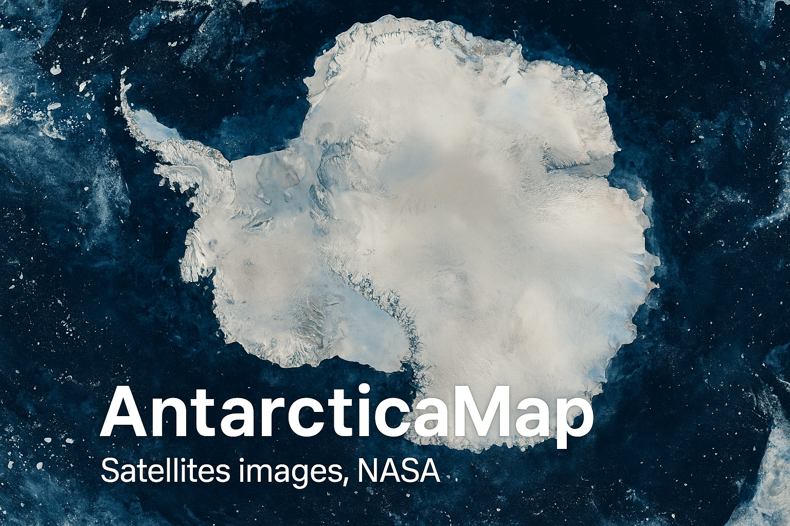

<p align="center">
  
</p>

<p align="center">
  <a href="https://swift.org">
    
  </a>
  <a href="https://swift.org/package-manager/">
    
  </a>
  
  <a href="LICENSE">
    
  </a>
</p>

<p align="center">
  <b>Swift Package для отрисовки тайловых карт Антарктиды с использованием спутниковых снимков NASA GIBS.</b>
</p>

<p align="center">
  <a href="README.md">English version</a>
</p>

---

## Возможности

- 🗺️ **Тайловая отрисовка** - Эффективная отрисовка больших спутниковых изображений с использованием `CATiledLayer`
- 🛰️ **Интеграция с NASA GIBS** - Прямой доступ к спутниковым снимкам NASA
- 🌍 **Проекция EPSG:3031** - Поддержка антарктической полярной стереографической проекции
- ⚡ **Конкурентная загрузка** - Настраиваемый network provider с дедупликацией запросов
- 📱 **SwiftUI & UIKit** - Поддержка современной и классической разработки под iOS
- 🔍 **Зум и панорамирование** - Плавное многоуровневое масштабирование с поддержкой жестов

## Быстрый старт

```swift
import AntarcticaMap

// Создаем параметры карты
let params = EarthDataMapRequest(
    minX: -4_000_000,
    minY: -4_000_000,
    maxX: 4_000_000,
    maxY: 4_000_000,
    width: 512,
    height: 512,
    date: Date(),
    layers: .modisTerraCorrectedReflectance
)

// Создаем view controller с network provider
let networkProvider = DefaultNetworkProvider(maxConcurrentRequests: 6)
let mapViewController = TiledMapViewController(
    params: params,
    imageSize: CGSize(width: 8192, height: 8192),
    networkProvider: networkProvider
)
```

Полный пример для SwiftUI с элементами управления см. в [Пример SwiftUI](Docs/ru/SwiftUIExample.md).

## Демонстрация
> **Примечание:** Демонстрация показывает управление картой, зум, панорамирование, выбор даты и сравнение асинхронной/синхронной загрузки. В режиме отладки вы можете видеть границы тайлов и индексы загружаемых тайлов.

<p align="center">
  
</p>


## Установка

### Swift Package Manager

Добавьте в `Package.swift`:

```swift
dependencies: [
    .package(url: "https://github.com/andrey-torlopov/AntarcticaMap.git", from: "0.0.1")
]
```

Или через Xcode: **File → Add Package Dependencies...**

## Документация

- 📦 [Руководство по установке](Docs/ru/Installation.md)
- 🚀 [Быстрый старт](Docs/ru/QuickStart.md)
- 💡 [Пример SwiftUI](Docs/ru/SwiftUIExample.md)
- 📖 [Примеры использования](Docs/ru/Examples.md)
- 🌐 [Руководство по Network Provider](Docs/ru/NetworkProvider.md)

## Требования

- iOS 17.0+
- Swift 6.2+
- Xcode 16.0+

## Архитектура

```
AntarcticaMap/
├── Model/              # Структуры данных (EarthDataMapRequest, протоколы)
├── Provider/           # Реализации источников тайлов (EarthDataTilesSource)
├── View/               # UI компоненты (TiledMapViewController, MapTiledView)
└── Helper/             # Утилиты (расчеты зума, форматирование дат)
```

## Источник данных

Библиотека использует спутниковые снимки, предоставляемые **NASA Global Imagery Browse Services (GIBS)**.

**GIBS** предоставляет спутниковые снимки в полном разрешении с различных миссий NASA, доступные в течение нескольких часов после получения. Изображения предоставляются через стандартные протоколы (WMS, WMTS) для простой интеграции.

🔗 **Документация NASA GIBS API**: [https://www.earthdata.nasa.gov/engage/open-data-services-software/earthdata-developer-portal/gibs-api](https://www.earthdata.nasa.gov/engage/open-data-services-software/earthdata-developer-portal/gibs-api)

### Доступные слои

В настоящее время поддерживается:
- **MODIS Terra Corrected Reflectance** - Изображения в естественных цветах со спутника Terra

Дополнительные слои можно добавить, расширив enum `EarthDataLayer`.

## Демо-приложение

Запустите таргет `AntarcticaMapDemo` чтобы увидеть:
- Выбор даты для исторических снимков
- Управление зумом и панорамированием
- Сравнение асинхронной и синхронной загрузки

## Лицензия

Проект лицензирован под MIT License.

## Благодарности

- **NASA GIBS** за предоставление бесплатных спутниковых снимков высокого разрешения
- Построено с использованием возможностей конкурентности Swift 6

## Поддержка

- 📖 [Документация](Docs/ru/)
- 🐛 [Сообщить о проблеме](https://github.com/andrey-torlopov/AntarcticaMap/issues)
